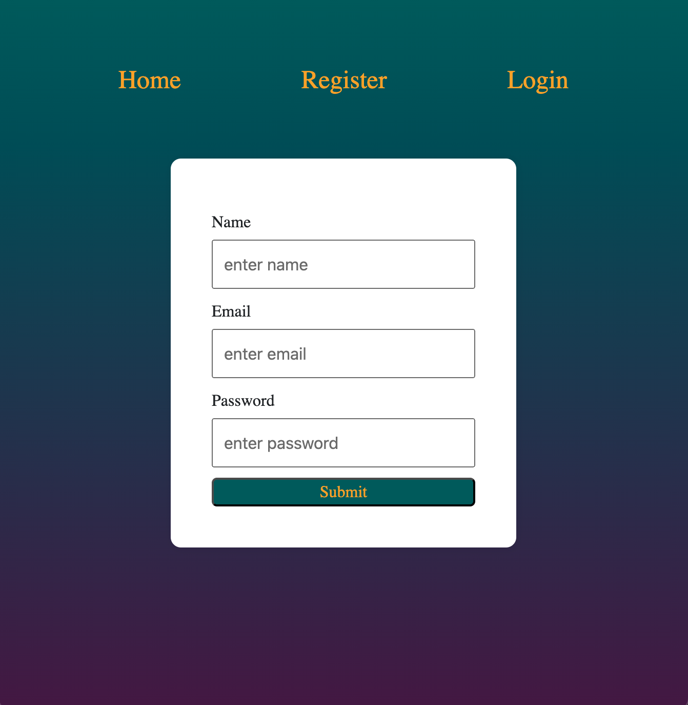

# MERN Authentication Register/Login 

## Description

This is a full-stack stack register and login page. The application uses authentication, authorization, encrypting password, user tracking with a cookie, and utilizes React-hot-toast notifactions. 

## Table of Contents 

- [Built With](#built-with)
- [Installation](#installation)
- [Usage](#usage)
- [Contribute](#how-to-contribute)
- [Questions/Contact](#questions)
- [License](#license)

## Built With

 

## Installation

1. Clone project repository down into your desired directory 
2. Open project terminal and run the command `npm install` to install the packages and dependencies for both client and server files
3. To invoke the application for client side, run the command `npm run dev` and open http://localhost:5173/ to view in the browser
4. To invoke the application for server side, run the command `npm start` and the database will connect
5. To end and stop the application from running, run the command `ctrl c`

## Usage

The image below shows the apperance of the application

## How to Contribute

If you would like to contribute, please refer to the Contributor Covenant guidelines on how to do so.

The [Contributor Covenant](https://www.contributor-covenant.org/).

## Questions

[Link to GitHub Profile](https://github.com/mandi7469)

If you have additional questions please email me at mandi7469@aol.com

## License

N/A